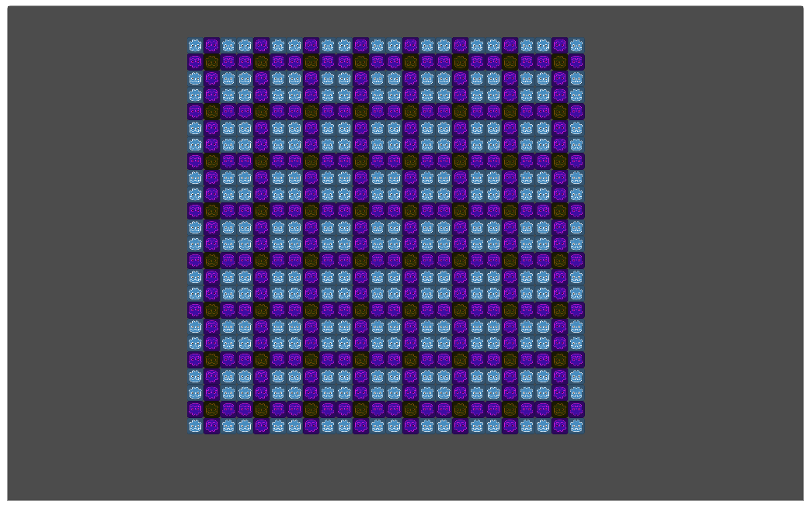
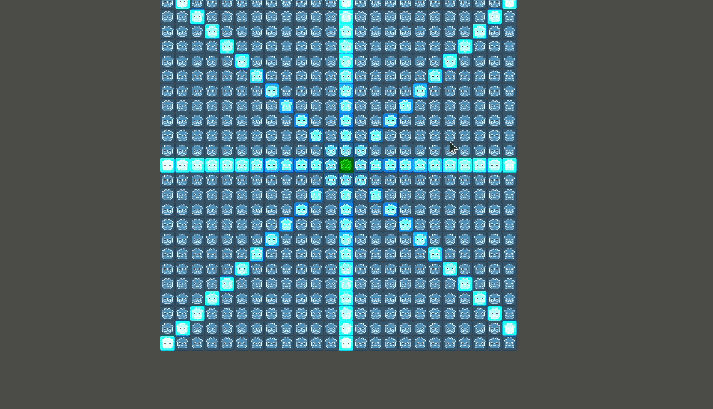

# godot-grid

A gdscript library to make working with rectangular grids easier.

__When to use it:__
  * You need access to every sprite in the grid and plan to manipulate them by code.
  * You want to generate the grid of sprites from code.

__When not to use it:__
  * You don't need to access the tiles from code.
  * You want to make the grid from the editor by hand. Use tilemaps for that.

## Preview

__Make patterns:__

__Easily work with Columns, Rows and Diagonals:__

## [Tutorial](./tutorial/README.md) (to see all Features)

### Applications
It's supposed to be useful when you have some sort of rectangular grid based system in your game.

  * tetris
  * chess
  * grid based puzzles
  * inventory maybe
  * grid based turn based combat maybe
  * ...

### Performance

Since every Tile is a Node (with potential children), you will get lags from 10k nodes upwards depending on the machine.

So this library is intended for comparativly small Grids.

Some features just use static information and thus are quite fast (the look up tables).
But others generate Arrays depending on the input and can become quite sluggish, when those arrays get too big.
See ['Access relative to a Tile' Chapter in the Tutorial](./tutorial/README.md)

You could circumvent this limitation by implementing some form of clustering or culling for the tiles in order to only calculate whats on/close to the screen.
See [Future Feature Ideas](#Future Feature Ideas)

### Installation

_Made with Godot version 3.4.2.stable.official.45eaa2daf_

This plugin depends on [XScene](https://github.com/aMOPel/godot-xchange-scene#installation)
You have to install it aswell.

This repo is in a __Godot Plugin format__.

You can:
<!-- - (Not yet) Install it via [__AssetLib__](https://godotengine.org/asset-library/asset/1018) or -->
- Download a __.zip__ of this repo and put it in your project

For more details, read the [godot docs on installing Plugins
](https://docs.godotengine.org/en/stable/tutorials/plugins/editor/installing_plugins.html)

__Don't forget to enable it in your project settings!__

### Future Feature Ideas

  * support for hex grid
  * support for triangular grid
  * support for clustering/culling to stop tiles not on screen and improve performance for huge grids
  * you can open an issue if you're missing a feature

### Attributions

<a href="https://www.flaticon.com/free-icons/menu" title="menu icons">Menu icons created by Kiranshastry - Flaticon</a>
