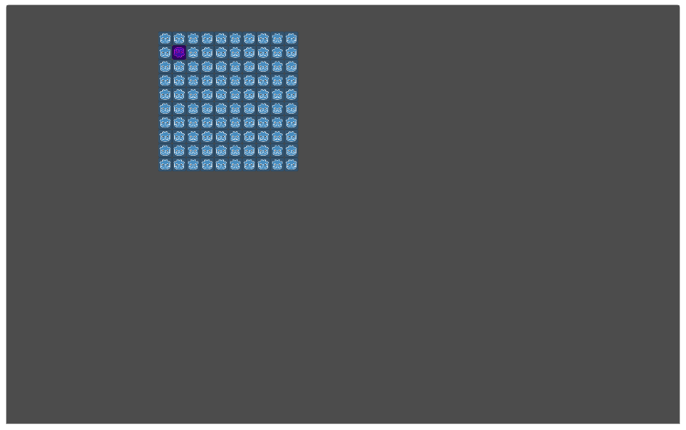

# Tutorial

<!-- TODO: manipulate grid chapter -->
__Variables that aren't defined in the code snippets are defined in previous code snippets__

## Generate the Grid
### Plain
```gdscript

# godot icon
onready var tile1 = preload("res://tutorial/Tile1.tscn")
# godot icon flipped and modulated pink
onready var tile2 = preload("res://tutorial/Tile2.tscn")
# godot icon modulated brown
onready var tile3 = preload("res://tutorial/Tile3.tscn")

var grid: Grid

func _ready():
	var tiles = {'one': tile1, 'two': tile2, 'three': tile3}

	# implicitly only uses 'one'
	grid = Grid.new(Vector2(10, 10), tiles)
	add_child(grid)
```


### With Pattern
```gdscript
	var pattern = [
		['one', 'two', 'one'],
		['two', 'three', 'two'],
		['one', 'two', 'one'],
	]
	grid = Grid.new(Vector2(10, 10), tiles, {pattern=pattern})
```


### With Random Distribution
```gdscript
	var distribution = {'one': 0.5, 'two':5, 'three':2}
	var grid = Grid.new(Vector2(10, 10), tiles, {distribution=distribution})
```


## Access
### Individually
```gdscript
	# grid_index
	var first = 0
	var middle = 49
	var last = 99

	# grid.g holds all tiles and their information
	print(grid.g[first])
	print(grid.g[middle])
	print(grid.g[last])

	# prints
	{falling_diag:9, grid_position:(0, 0), position:(0, 0), rising_diag:0, tile_key:one}
	{falling_diag:4, grid_position:(4, 9), position:(576, 256), rising_diag:13, tile_key:one}
	{falling_diag:9, grid_position:(9, 9), position:(576, 576), rising_diag:18, tile_key:one}

	# grid.x is an instance of XScene
	# grid.x.x(grid_index) returns the node of the tile
	grid.x.x(first).modulate = Color.green
	grid.x.x(middle).modulate = Color.green
	grid.x.x(last).modulate = Color.green
```


### By Col/Row
```gdscript
	# lut == look up table
	# luts are generated once at Grid._ready(), since all indices are constant
	# thus accessing them is very cheap
	var col = grid.g[middle].grid_position.x
	for i in grid.col_lut[col]:
		grid.x.x(i).modulate = Color.green

	var row = grid.g[middle].grid_position.y
	for i in grid.row_lut[row]:
		grid.x.x(i).modulate = Color.green
```


### By Diagonals
```gdscript
	var middle = 47
	var rising = grid.g[middle].rising_diag
	for i in grid.rising_diag_lut[rising]:
		grid.x.x(i).modulate = Color.green

	var falling = grid.g[middle].falling_diag
	for i in grid.falling_diag_lut[falling]:
		grid.x.x(i).modulate = Color.green
```


### By `tile_key`
```gdscript
	# remember the pattern from earlier
	grid = Grid.new(10, 10, tiles, {pattern=pattern})
	add_child(grid)

	var one_tiles = grid.get_tiles_by_tile_key('one')
	for i in one_tiles:
		grid.x.x(i).modulate = Color.green
```


## Access relative to a Tile
### Location

The location system allows you to specify a tile by its `grid_index` or by its col/row

`partial_location` can be
  * `grid_index: int` or 
  * `grid_position: Vector2` or 
  * `{grid_index: int}` or `{grid_position: Vector2}` or 
  * `{grid_index: int, grid_position: Vector2}`

`location` is `{grid_index: int, grid_position: Vector2}`

```gdscript
	var partial_location = Vector2(2, 5)
	var location = grid.to_location(partial_location)
	grid.x.x(location.grid_index).modulate = Color.red
```


### Neighbors
```gdscript
	var distance = 4
	var ortho = grid.get_orthogonal_neighbors(partial_location, distance)
	var diag = grid.get_diagonal_neighbors(partial_location, distance)
	for i in ortho:
		grid.x.x(i).modulate = Color.green
	for i in diag:
		grid.x.x(i).modulate = Color.yellow
```


```gdscript
	var all = grid.get_all_neighbors(partial_location, distance)
	for i in all:
		grid.x.x(i).modulate = Color.green
```


### Cols/Rows
```gdscript
	var around = grid.get_cols_rows_around(partial_location, distance)
	# returns `{rows = {above: Array, below: Array}, cols = {left: Array, right: Array}}` \

	for row_index in around.rows.above:
		for i in grid.row_lut[row_index]:
			grid.x.x(i).modulate += Color.blue
	for col_index in around.cols.right:
		for i in grid.col_lut[col_index]:
			grid.x.x(i).modulate += Color.yellow
```


### Rings
```gdscript
	var color = Color.white
	var rings = grid.get_rings_around(partial_location, distance)
	for ring in rings:
		color += Color(0.1, 0.1, 0.1)
		for i in ring:
			grid.x.x(i).modulate = color
```


```gdscript
	# the neighbor functions can also return in rings, instead of 1D array
	var enable_rings = true
	var rings = grid.get_all_neighbors(partial_location, distance, enable_rings)
	for ring in rings:
		color += Color(0.1, 0.1, 0.1)
		for i in ring:
			grid.x.x(i).modulate = color
```


## Manipulate the Grid
### Change `tile_key`

```gdscript
	var partial_location = Vector2(2, 5)

	grid.switch_tile(partial_location, 'two')
```


### Move Tile

```gdscript
	var partial_location_from = partial_location
	var partial_location_to = Vector2(1, 1)

	grid.move_tile(partial_location_to, partial_location_from)
```


### Change State with XScene

For detailed information see the [XScene repository](https://github.com/aMOPel/godot-xchange-scene)

Basicly XScene lets you alter the state of a scene between 
  * ACTIVE == in the tree and visible
  * HIDDEN == in the tree but `.visible == false`
  * STOPPED == not in the tree but still in memory
  * FREE == no longer in memory
Godot already provides this functionality obviously, but XScene abstracts it and provides a higher level API.
And since XScene indexes the managed nodes with their respective states, you can access nodes grouped by state.

```gdscript
	var partial_location = Vector2(2, 5)
	var location = grid.to_location(partial_location)

	var row = grid.row_lut[location.grid_position.y]
	var col = grid.col_lut[location.grid_position.x]

	# the keys for XScene are the grid_indices
	grid.x.remove_scenes(row, {method_remove=XScene.HIDDEN})
	grid.x.remove_scenes(col, {method_remove=XScene.HIDDEN})

	print(grid.x.hidden)
	# prints
	[2, 12, 22, 32, 42, 50, 51, 52, 53, 54, 55, 56, 57, 58, 59, 62, 72, 82, 92]
	#|------col-------|--------------------row-----------------|-----col-----|

```

	
### Change anything
```gdscript
	# a plain grid is assumed here
	var partial_location_to = Vector2(9, 9)

	# changes tile_key, state, and position all at once
	grid.change_tile(partial_location, {tile_key='two', state=XScene.HIDDEN, location=partial_location_to})
```


```gdscript
	grid.x.show_scenes(grid.x.hidden)
```


## Utilities
```gdscript
	var partial_location_from = Vector2(3, 4)
	var location_from = grid.to_location(partial_location_from)
	grid.x.x(location_from.grid_index).modulate = Color.red

	var partial_location_to = Vector2(5, 8)
	var location_to = grid.to_location(partial_location_to)
	grid.x.x(location_to.grid_index).modulate = Color.red

	var distance = grid.get_distance_between(partial_location_to, partial_location_from)
	print(distance)
	# prints
	{grid_index:42, grid_position:(2, 4)}

	print(
		grid.to_location(partial_location_from).grid_index + distance.grid_index
		==
		grid.to_location(partial_location_to).grid_index
	)
	# prints
	True
```


```gdscript
	var rect = grid.get_rect_between(partial_location_to, partial_location_from)

	for i in rect:
		grid.x.x(i).modulate = Color.green

  # the corners are modulated red afterwards
```


## Clusters

### In Grid

```gdscript
  # passing `cluster_dimensions: Vector2` enables clusters
	grid = Grid.new(Vector2(9, 9), tiles, {cluster_dimensions=Vector2(2,2)})
	add_child(grid)

  # color the tiles in every other cluster green
	for i in grid.cluster_lut.size():
		for j in grid.cluster_lut[i]:
			if i % 2 == 0:
				grid.x.x(j).modulate = Color.green

  # the cluster index of a tile is also accessible in `Grid.g`
	print(grid.g[0].cluster) # -> 0
	print(grid.g[2].cluster) # -> 1
```


### In ClusteredGrid
`ClusteredGrid` creates 2 `Grid` instances, `grid` and `cluster_grid`.
`grid` is the normal `Grid` you would expect, also with the `cluster_lut`.
`cluster_grid` is an empty `Grid` where the clusters in `grid` are the tiles.
This enables you to use the full power of the `Grid` class to manipulate clusters.

```gdscript
	clustered_grid = ClusteredGrid.new(Vector2(10, 10), tiles, {cluster_dimensions=Vector2(2,2)})
	add_child(clustered_grid)
	grid = clustered_grid.grid
	cgrid = clustered_grid.cluster_grid

  # cgrid has all the functionality of the Grid class
  # use grid.cluster_lut[cluster_index] to access the grid tiles of a cluster
	for i in cgrid.rising_diag_lut[3]:
		for j in grid.cluster_lut[i]:
			grid.x.x(j).modulate = Color.green
```


#### Keep in Mind

```gdscript
  # grid_dimensions and cluster_dimensions have to be evenly divisible here,
  # because in a Grid, all tiles must have the same size
  # this throws an error
	clustered_grid = ClusteredGrid.new(Vector2(9, 9), tiles, {cluster_dimensions=Vector2(2,2)})

  # if you do a transform, do it on the `ClusteredGrid` instance,
  # to transform both `grid` and `cluster_grid`
	clustered_grid.rotate(PI/8)

  # because cgrid contains no nodes x.x() will return null
	cgrid.x.x(0) == null # -> true
```

## Collision

### Rect2 and Polygon2
```gdscript
func _ready():
	grid = Grid.new(Vector2(10, 10), tiles)
	add_child(grid)
	grid.rotate(PI/8)

	grid.show_behind_parent = true

  # Rect2 encompassing the whole grid, coordinates are local to grid
  print(grid.rect) # -> (0, 0, 640, 640)

func _draw():
	var green = Color(0,1,0,0.5)
	var greens = [green,green,green,green,]

  # draw a green square on the grid using `grid.polygon`
	var poly = poly_to_global(grid, grid.polygon)
	draw_polygon(poly, greens)

# just turns polys node local coordinates to global coordinates
func poly_to_global(node, poly):
	var global_poly = PoolVector2Array([])
	for i in poly:
		global_poly.append(node.to_global(i))
	return global_poly
```


### Area2D
```gdscript
  # if `args.enable_area`, a Area2D is added to the grid, with a CollisionPolygon2D as a child
	grid = Grid.new(Vector2(10, 10), tiles, {enable_area=true})
	add_child(grid)
	grid.rotate(PI/8)
```
This Screenshot was taken with Debug -> Visible Collision Shapes turned on.


### with Clusters
`if args.enable_cluster_area`: `cluster_grid` is no longer empty
but of the following structure:
`cluster_grid`
\ |-`Area2D`
\   |-`XScene`
\   |-`CollisionPolygon2D`
\   |-`CollisionPolygon2D`
\   |-...
with Each `CollisionPolygon2D` representing a cluster and being a `shape_owner` under `Area2D`

```gdscript
	clustered_grid = ClusteredGrid.new(Vector2(10, 10), tiles, {enable_cluster_area=true,cluster_dimensions=Vector2(2,2)})
	print(cgrid.x.x(5) is CollisionPolygon2D) # -> true
	print(cgrid.get_child(0) is Area2D) # -> true
```
This Screenshot was taken with Debug -> Visible Collision Shapes turned on.


### Example with Movement:
```gdscript
func _ready():
	clustered_grid = ClusteredGrid.new(Vector2(50, 50), tiles, {enable_cluster_area=true,cluster_dimensions=Vector2(5,5)})
	add_child(clustered_grid)
	grid = clustered_grid.grid
	cgrid = clustered_grid.cluster_grid
	clustered_grid.rotate(PI/8)
	
  # tile2 actually has an Area2D and CollisionPolygon2D
	t = tile2.instance()
	add_child(t)
	t.position = Vector2(250,500)
	t.scale = Vector2(10,10)
	t.rotate(-PI/8)

  # connect the signals of the Area2D under cgrid
	cgrid.get_child(0).connect('area_shape_entered', self, '_on_cluster_shape_entered')
	cgrid.get_child(0).connect('area_shape_exited', self, '_on_cluster_shape_exited')

# remove the tiles that overlap with t
func _on_cluster_shape_entered(area_rid: RID, area: Area2D, area_shape_index: int, local_shape_index: int) -> void:
	if area == t.get_child(0):
		grid.x.remove_scenes(grid.cluster_lut[local_shape_index], {method_remove=XScene.STOPPED})
	
# add back the tiles that overlap with t
func _on_cluster_shape_exited(area_rid: RID, area: Area2D, area_shape_index: int, local_shape_index: int) -> void:
	if area == t.get_child(0):
		grid.x.show_scenes(grid.cluster_lut[local_shape_index])

# just to make the camera follow
func _process(delta):
	$Camera2D.position = t.position

# simple 4 direction arrow key movement for t
func _input(event):
	var step = 20
	if event.is_action_pressed('ui_right', true):
		t.position.x += step
	if event.is_action_pressed('ui_left', true):
		t.position.x -= step
	if event.is_action_pressed('ui_up', true):
		t.position.y -= step
	if event.is_action_pressed('ui_down', true):
		t.position.y += step
```
This GIF was taken with Debug -> Visible Collision Shapes turned on.

